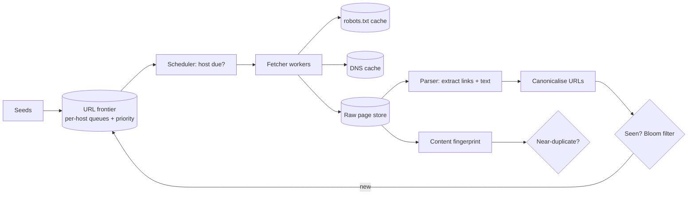

import H from '@site/src/components/Highlight';
import C from '@site/src/components/Color';
import Plain from '@site/src/components/Plain';
import Jargon from '@site/src/components/Jargon';
import Depth from '@site/src/components/Depth';
import Trace, { TraceStep } from '@site/src/components/Trace';

# Design a Web Crawler

> **The drill:** fetch a large portion of the web, repeatedly. <C color="orange">The interesting constraints are not throughput — they are politeness, deduplication at enormous scale, and not getting trapped.</C>

<Plain>

A team surveying every building in a country, then re-surveying as things change.

**You cannot visit the same street constantly.** Sending fifty surveyors to one small street disrupts it — and the owner will stop letting you in. <C color="orange">So there is a limit per street, not just an overall limit</C>, and that constraint shapes the entire schedule.

**You must not survey the same building twice.** With billions of buildings, "have I seen this one?" cannot mean checking a list you carry in your pocket.

**And addresses lie.** The same building has several addresses — with and without a house number, with a trailing slash, reached from different directions. <C color="crimson">Different addresses, same building</C>, and treating them as distinct wastes most of your effort.

**Some streets are traps.** A road that generates a new house number every time you look, forever. A surveyor following addresses mechanically walks down it and never returns. <C color="crimson">Nothing about the road announces this</C> — it looks like any other.

**And re-survey rates should differ.** A construction site changes weekly; a monument does not change in a decade. Visiting both at the same interval wastes effort on one and misses changes in the other.

</Plain>

---

## 1. Scope and estimates

**In:** fetch pages from seed URLs, extract links, store content, revisit for freshness. Respect `robots.txt` and rate limits.
**Out:** indexing and ranking (a separate system), JavaScript rendering (mention it — it changes the cost model substantially), the search product itself.

```
  Target: 10B pages, refreshed monthly on average
  →  10B / 30 days  ≈  4,000 pages/s sustained

  Page size ~500 KB raw, ~100 KB text
  Bandwidth: 4,000 × 500 KB  ≈  2 GB/s  ≈  16 Gbps
  Storage:   10B × 100 KB    ≈  1 PB of text, more with history
```

<C color="green">4,000 pages/second is achievable with modest hardware.</C> <C color="crimson">The difficulty is entirely in *which* page to fetch next and *whether you have seen it before*.</C>

---

## 2. Politeness is the scheduling constraint

<Jargon
  plain="Not overwhelming any single site, and honouring its stated rules."
  term="crawler politeness"
  also={['robots.txt', 'crawl-delay', 'per-host rate limiting']}>

<C color="crimson">A crawler that ignores this gets blocked, and rightly.</C> Politeness is not courtesy — it is what keeps you able to crawl at all, which makes it a hard constraint rather than a nicety.

</Jargon>

The rules, and their design consequences:

| Rule | Consequence |
| :--- | :--- |
| Honour `robots.txt` | Fetch and cache it **per host** before crawling anything there |
| One request per host at a time (typically) | <C color="orange">The frontier must be organised **by host**, not as a flat queue</C> |
| Respect `crawl-delay` | Per-host scheduling with a next-allowed timestamp |
| Identify yourself honestly | A `User-Agent` with contact details |

<H>That second row is the key architectural consequence. A single global URL queue cannot enforce per-host limits — the frontier must be a collection of per-host queues, scheduled so that only one worker touches a given host at a time.</H>

<Trace title="Choosing what to fetch next" subtitle="Why a flat queue fails, and what replaces it.">

<TraceStep
  title="A single global queue"
  cost="hammers popular hosts"
  state={{ 'Structure': 'one FIFO queue', 'Per-host control': 'none', 'Effect': '50 workers hit one site', 'Verdict': 'blocked' }}
  changed={['Structure', 'Per-host control', 'Effect', 'Verdict']}
  note="A large site contributes millions of URLs, which cluster together in the queue.">

<C color="crimson">Workers pull the next URL and dozens land on the same host simultaneously.</C>

</TraceStep>

<TraceStep
  title="Per-host queues"
  state={{ 'Structure': 'queue per host', 'Per-host control': 'yes', 'Effect': 'one worker per host', 'Verdict': 'polite' }}
  changed={['Structure', 'Per-host control', 'Effect', 'Verdict']}
  note="A worker is assigned a host, drains it politely, and moves on.">

<C color="green">Each host has its own queue and a next-allowed-fetch time.</C> A scheduler hands a worker a host that is due.

</TraceStep>

<TraceStep
  title="Prioritise within and across hosts"
  state={{ 'Priority signals': 'page rank, change rate, depth', 'Effect': 'important pages first', 'Verdict': 'useful' }}
  changed={['Priority signals', 'Effect']}
  note="With 10B pages and finite capacity, what you skip matters as much as what you fetch.">

<C color="green">Not all pages deserve equal attention.</C> Prioritise by estimated importance and by how often the page changes.

</TraceStep>

<TraceStep
  title="Adaptive re-crawl"
  state={{ 'News site': 'hourly', 'Static page': 'monthly or less', 'Wasted fetches': 'greatly reduced', 'Freshness': 'better' }}
  changed={['News site', 'Static page', 'Wasted fetches', 'Freshness']}
  note="Track observed change rate per URL and adjust the interval — more frequent for volatile pages, less for stable ones.">

<H>A uniform re-crawl interval is wrong in both directions simultaneously: too slow for pages that change hourly, and wasteful for pages that have not changed in years. Adaptive scheduling is where crawl budget is actually won.</H>

</TraceStep>

</Trace>

---

## 3. Deduplication at two levels

**URL deduplication — have I seen this address?**

10 billion URLs cannot be held in a hash set on one machine. <C color="green">A Bloom filter</C> — at ~10 bits per URL, 10B URLs is ~12 GB, shardable across machines. False positives mean occasionally skipping a page you have not seen, which is [an acceptable direction of error](../14-building-blocks/02-bloom-filters.md).

**But first, canonicalise.** The same page has many URLs:

```
  http://example.com/page      https://example.com/page
  https://www.example.com/page https://example.com/page/
  https://example.com/page?utm_source=twitter
  https://example.com/page#section
```

<C color="crimson">Without normalisation, the same page is fetched many times</C> and the dedup structure fills with variants. Canonicalisation — scheme and host lowercasing, default-port removal, fragment stripping, tracking-parameter removal, path normalisation, honouring `rel=canonical` — is unglamorous and one of the highest-value components.

**Content deduplication — is this the same page under a different address?**

Mirrors, syndicated articles and printer-friendly versions produce near-identical content at different URLs. <C color="green">Fingerprint the content</C>: an exact hash catches identical pages; **SimHash** or **MinHash** catches *near*-duplicates, which is what most of the web's redundancy looks like.

---

## 4. The architecture



<C color="green">Cache DNS aggressively.</C> A DNS lookup per fetch would make DNS resolution the bottleneck — at 4,000 fetches/second, resolution is a significant fraction of total latency and load.

---

## 5. Traps and the things that go wrong

<Depth title="Crawler traps, JavaScript, and the politeness-versus-coverage trade">

**Crawler traps are the failure that ruins a naive crawler.**

| Trap | Mechanism |
| :--- | :--- |
| **Infinite calendars** | `/calendar?date=2027-03-01` → links to the next day, forever |
| **Session ids in URLs** | Every fetch generates a new URL for the same page |
| **Faceted navigation** | Filter combinations produce a combinatorial explosion of URLs |
| **Deliberate spider traps** | Dynamically generated infinite link graphs |
| **Redirect loops** | A → B → A |

<C color="green">Defences, layered:</C> cap crawl **depth** per host; cap total URLs per host; detect **near-duplicate content** and stop following links from pages that are near-identical to ones already fetched; strip session-like parameters during canonicalisation; and cap redirect chains.

<C color="crimson">The most reliable signal is content-based, not URL-based</C> — a calendar's pages are near-identical, so near-duplicate detection catches traps that no URL pattern would.

**JavaScript rendering changes the cost model entirely.** Much of the modern web renders client-side, so fetching HTML yields little. Rendering means running a headless browser per page — <C color="crimson">roughly an order of magnitude more CPU and memory per page than an HTTP fetch.</C>

The practical answer is **selective rendering**: fetch HTML cheaply, detect whether meaningful content is missing, and re-fetch with rendering only for those pages. <C color="green">Say this explicitly if asked</C> — "we render everything" is not affordable at 10B pages, and "we don't render" misses much of the web.

**Politeness versus coverage is a genuine tension.** One request per host at a time means a site with 10 million pages takes a very long time at one page per second. Options: negotiate higher rates with large sites (real crawlers do), use the site's own sitemap and change feeds, and prioritise ruthlessly within the host.

**Distributed crawling needs care about who owns a host.** <C color="crimson">Two machines crawling the same host independently violate politeness even if each is individually polite.</C> So hosts must be **partitioned across crawler nodes** — consistent-hash the hostname — so exactly one node is responsible for a given host at a time.

**Storage layering.** Raw HTML is large and rarely re-read after parsing; extracted text is small and read often. <C color="green">Store raw in object storage with lifecycle tiering, and text in whatever the indexer consumes</C> — the same [tiering argument](../04-data-storage/06-object-storage.md) as elsewhere.

**Failure modes:**

| Failure | Effect | Handling |
| :--- | :--- | :--- |
| Frontier lost | Crawl state gone | Persist it; it is the system's real state, not the pages |
| A host goes down | Repeated failed fetches | Exponential backoff per host; eventually deprioritise |
| Bloom filter fills | Everything looks seen | Size for maximum URLs; monitor fill ratio; rotate |
| Trap not detected | Crawl budget consumed | Per-host caps as a backstop, independent of trap detection |

<H>The thing to recognise: the frontier is the system. Fetching is easy and parallel; deciding what to fetch next, without repeating yourself, without being blocked, and without falling into a hole, is the entire design.</H>

</Depth>

---

## 6. What a good answer sounds like

> *"Throughput isn't the hard part — 4,000 pages a second is modest. The design is the frontier. Politeness means one request per host at a time and honouring `robots.txt`, so the frontier is per-host queues with a next-allowed time, not a global queue — and hosts are partitioned across crawler nodes by consistent hash, or two nodes independently hammer the same site. Deduplication happens twice: canonicalise URLs then check a sharded Bloom filter, and fingerprint content with SimHash to catch mirrors and near-duplicates. Near-duplicate detection is also the most reliable trap defence, since calendar traps generate near-identical pages that no URL pattern catches. Re-crawl adaptively by observed change rate. JavaScript rendering is roughly 10× the cost, so render selectively based on whether the HTML looks empty."*

---

## Rapid-fire recall

1. What is genuinely hard here, and what is not?
2. Why must the frontier be organised per host rather than as one queue?
3. What must happen before crawling any host, and what should be cached per host?
4. Why is URL canonicalisation high-value, and name four normalisations.
5. What structure handles "have I seen this URL?", and what error does it make?
6. What is content deduplication for, and which technique catches near-duplicates?
7. Name four crawler traps and the most reliable defence.
8. Why is a uniform re-crawl interval wrong in both directions?
9. How does JavaScript rendering change the cost model, and what is the practical answer?
10. Why must hosts be partitioned across crawler nodes?

<details>
<summary>Answers</summary>

1. **Hard:** deciding what to fetch next, deduplication at 10B scale, politeness, and avoiding traps. **Not hard:** raw throughput — 4,000 pages/second is achievable with modest hardware.
2. Because **politeness is per host** — a single global queue cannot enforce one-request-at-a-time per site, and large sites contribute URLs that cluster together, so many workers would hit one host simultaneously.
3. Fetch and honour **`robots.txt`**. Cache **`robots.txt` and DNS resolutions** per host — at 4,000 fetches/second, per-fetch DNS lookups would become a bottleneck in themselves.
4. Because **the same page has many URLs**, so without it the same content is fetched repeatedly and the dedup structure fills with variants. Normalisations: **lowercase scheme and host**, **remove default ports**, **strip fragments**, **remove tracking parameters**, **normalise paths**, **honour `rel=canonical`**.
5. A **sharded Bloom filter** (~10 bits/URL, ~12 GB for 10B). Its error is a **false positive** — occasionally skipping an unseen page, which is the harmless direction.
6. Catching **the same content at different URLs** — mirrors, syndication, printer-friendly versions. **SimHash or MinHash** catch near-duplicates, which is what most web redundancy looks like.
7. **Infinite calendars** · **session ids in URLs** · **faceted navigation explosions** · **deliberate spider traps** · **redirect loops**. Most reliable defence: **near-duplicate content detection**, because trap pages are near-identical while no URL pattern reliably identifies them.
8. It is simultaneously **too slow for pages that change hourly** and **wasteful for pages unchanged in years**. Adaptive scheduling by observed change rate is where crawl budget is won.
9. Rendering requires a **headless browser per page** — roughly **an order of magnitude more CPU and memory** than an HTTP fetch. Practical answer: **selective rendering**, fetching HTML cheaply and re-fetching with rendering only when the content appears empty.
10. Because **two nodes crawling one host independently violate politeness** even if each is individually polite. Consistent-hash the hostname so exactly one node owns a given host at a time.

</details>

---

**Next:** [Design Dropbox](./14-dropbox.md) — file sync, and why it is harder than file storage.
