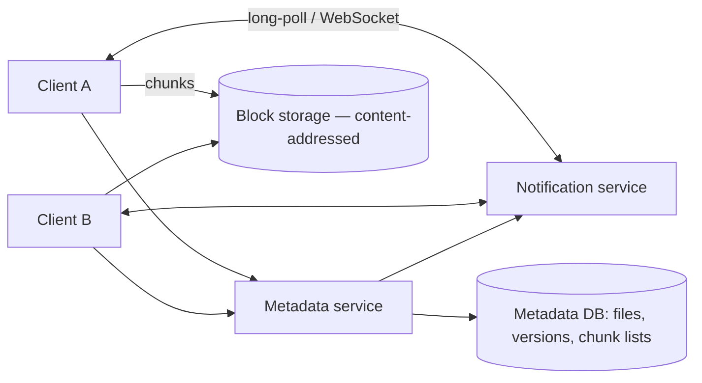

import H from '@site/src/components/Highlight';
import C from '@site/src/components/Color';
import Plain from '@site/src/components/Plain';
import Jargon from '@site/src/components/Jargon';
import Depth from '@site/src/components/Depth';
import Trace, { TraceStep } from '@site/src/components/Trace';

# Design Dropbox

> **The drill:** file sync across devices. <C color="orange">Storing files is easy; keeping several copies in agreement while people edit them offline is not</C> — and that distinction is what the question tests.

<Plain>

A shared filing cabinet that everyone also keeps a personal copy of.

Storing files is the easy half. The hard half has three parts.

**Sending less.** Changing one paragraph in a long document should not mean posting the whole document again. Ideally you send only the paragraph — which requires working out, without sending anything, **which part changed**.

**Not storing the same thing repeatedly.** Fifty people have a copy of the same handbook. Keeping fifty identical copies is wasteful when one would do, with fifty pointers to it.

**Deciding what happens when two people change the same file while disconnected.** Both changes are real. Unlike a shared document with a live connection, there is no moment where they could have been merged as they happened — <C color="crimson">you are handed two finished versions and must decide.</C>

And for a general file, the honest answer is uncomfortable: **you cannot merge them.** A word processor file, a photo, a spreadsheet — there is no automatic merge that is correct. The best a sync service can do is keep both, name them clearly, and let a human decide.

</Plain>

---

## 1. Scope and the key insight

**In:** upload/download; sync across devices; sharing; version history; offline editing; conflict handling.
**Out:** collaborative real-time editing ([a different problem](./09-google-docs.md)), rich previews, full-text search.

```
  500M users, ~100M active
  Average 50 GB stored per active user  →  ~5 EB nominal
  But: heavy duplication across users (shared files, common documents)
```

<H>The design turns on one decision: files are stored as **content-addressed chunks**, not as whole files. Deduplication, delta sync, versioning and integrity all fall out of that single choice.</H>

---

## 2. Chunking is the foundation

<Jargon
  plain="Splitting a file into pieces and naming each piece by the hash of its contents."
  term="content-addressed chunking"
  also={['content-defined chunking', 'block-level dedup']}>

A file becomes a **list of chunk hashes**. <C color="green">Identical chunks anywhere — same file, different file, different user — are stored once</C>, and a chunk's name is derived from its content, so it is immutable and self-verifying.

</Jargon>

<Trace title="Editing one paragraph in a 100 MB file" subtitle="Why chunk boundaries must depend on content, not position.">

<TraceStep
  title="Naive — upload the whole file"
  cost="100 MB"
  state={{ 'Uploaded': '100 MB', 'Stored': 'new full copy', 'Dedup': 'none', 'Verdict': 'unusable' }}
  changed={['Uploaded', 'Stored', 'Verdict']}
  note="Every save of a large file re-uploads it entirely — over a home connection, minutes per keystroke session.">

</TraceStep>

<TraceStep
  title="Fixed-size chunks"
  cost="insertion breaks everything"
  state={{ 'Chunk size': '4 MB fixed', 'Edit at start': 'shifts all later bytes', 'Chunks changed': 'ALL of them', 'Verdict': 'fails on insert' }}
  changed={['Chunk size', 'Edit at start', 'Chunks changed', 'Verdict']}
  note="The boundary problem: inserting one byte at the front re-aligns every subsequent chunk boundary.">

Split every 4 MB. Editing in the middle changes one chunk — <C color="crimson">but *inserting* bytes shifts everything after, so every later chunk has different content and a different hash.</C>

</TraceStep>

<TraceStep
  title="Content-defined chunking"
  state={{ 'Boundary': 'where a rolling hash hits a pattern', 'Edit at start': 'boundaries realign quickly', 'Chunks changed': '1–2', 'Verdict': 'works' }}
  changed={['Boundary', 'Edit at start', 'Chunks changed', 'Verdict']}
  note="A rolling hash over a sliding window; cut where the hash matches a pattern. Boundaries follow content, not offsets.">

<C color="green">Because boundaries are determined by the surrounding bytes, an insertion shifts only the chunks around it</C> — the rest realign to the same boundaries and keep their hashes.

</TraceStep>

<TraceStep
  title="Upload only what is new"
  cost="~8 MB instead of 100"
  state={{ 'Client sends': 'chunk hash list', 'Server replies': 'which it lacks', 'Uploaded': 'a few chunks', 'Verdict': 'delta sync' }}
  changed={['Client sends', 'Server replies', 'Uploaded']}
  note="Hash the chunks locally, ask which are missing, send only those.">

<C color="green">The client sends hashes first.</C> The server answers which it has never seen; only those are uploaded.

</TraceStep>

<TraceStep
  title="Deduplication falls out for free"
  state={{ 'Same file, 50 users': 'stored once', 'Storage saved': 'large', 'Cost': 'a reference count', 'Verdict': 'free' }}
  changed={['Same file, 50 users', 'Storage saved', 'Cost']}
  note="If two users upload the same file, the second upload transfers nothing at all — the hashes already exist.">

<H>Content addressing gives delta sync, cross-user deduplication, versioning and integrity checking from one mechanism. This is why it is the foundational decision rather than an optimisation.</H>

</TraceStep>

</Trace>

---

## 3. Sync and metadata

The **metadata service** is the system of record: which files exist, their chunk lists, versions, and permissions. <C color="green">Files are immutable chunks in object storage; everything mutable lives in metadata.</C>



**The sync loop:**

1. Client watches the local filesystem for changes.
2. On change: chunk the file, compute hashes, ask which chunks are missing, upload those.
3. Commit a new file version in metadata (chunk list + parent version).
4. Metadata notifies other devices.
5. Those devices fetch the new chunk list, download only chunks they lack, and reassemble.

<C color="green">Notification uses a long-lived connection</C> so changes propagate in seconds — polling every device every few seconds does not scale to hundreds of millions of clients.

---

## 4. Conflicts

<C color="crimson">Two devices edit the same file offline. Both versions are real.</C>

Unlike [collaborative editing](./09-google-docs.md), there is no operation stream — you have two finished blobs and no way to know what changed semantically.

**What is possible:**

| Approach | Applicability |
| :--- | :--- |
| <C color="green">Detect via version vectors</C> | Always — tells you it *is* a conflict rather than an ordering |
| <C color="crimson">Automatic merge</C> | Only for known formats with merge semantics (text, some structured files) |
| <C color="green">Keep both, rename one</C> | <C color="green">The honest general answer</C> — `report (conflicted copy from Anna's laptop).docx` |
| <C color="crimson">Last write wins</C> | Silently destroys work — avoid |

<H>The conflicted-copy file is not a cop-out; it is the correct answer for arbitrary binary content. The design decision is to detect conflicts reliably and never silently discard a version — not to pretend a merge is possible.</H>

**Detecting** requires each version to record its **parent version**. If a client commits a version whose parent is not the current head, that is a conflict — not a fast-forward. <C color="green">This is the same mechanism as optimistic locking</C>, applied to files.

---

## 5. What interviewers push on

<Depth title="Deduplication's hidden problems, and sync at the edges">

**Cross-user deduplication has a security consequence people miss.**

If a client can ask *"do you already have chunk `abc123`?"* and skip the upload when the answer is yes, then <C color="crimson">an attacker who guesses a chunk's hash learns whether that content exists in the system.</C> With a known file — a specific leaked document, a particular photo — this becomes a confirmation oracle.

Mitigations: only deduplicate **within a user's own account**, require **proof of possession** (the server challenges the client to produce a random byte range of the chunk), or deduplicate server-side after upload so the client learns nothing. <C color="green">Raising this unprompted is a strong signal</C> — it is a real problem that affected real products.

**Encryption and deduplication are in tension.** If each user encrypts with their own key, identical files produce different ciphertext and <C color="crimson">deduplication becomes impossible.</C> Convergent encryption (deriving the key from the content) restores it and reintroduces the confirmation-oracle problem. There is no free answer; the honest position is that <C color="orange">end-to-end encryption and cross-user deduplication are fundamentally incompatible</C>, and the product must choose.

**Reference counting and deletion.** A chunk is shared by many files, so deleting a file cannot delete its chunks. You need reference counts or periodic mark-and-sweep garbage collection. <C color="crimson">Reference counts are racy under concurrent upload and deletion</C> — a chunk's count can hit zero just as a new file references it. Practical systems use a grace period before actual deletion.

**Small files behave badly.** Chunking overhead dominates for a 2 KB file, and a folder of 50,000 tiny files generates 50,000 metadata operations. <C color="green">Batch small files</C> into a combined transfer, and treat metadata operations as the scaling dimension rather than bytes.

**Partial sync and selective sync.** Users with more data than local disk need to sync a subset, or use placeholder files hydrated on access. This changes the client substantially — it must present files that are not actually present, and fetch them transparently on open.

**Bandwidth and battery on mobile.** Continuous sync is expensive on a phone. Real clients throttle, defer to WiFi, and batch. <C color="orange">Worth mentioning that the mobile client is a different product from the desktop one</C>, not just a smaller one.

**Failure modes:**

| Failure | Effect | Handling |
| :--- | :--- | :--- |
| Upload interrupted | Partial chunks | Chunks are independent — resume from the missing ones |
| Metadata and blocks diverge | File references a missing chunk | Chunks committed before metadata; GC with grace period |
| Client clock wrong | Bad conflict decisions | Use **version vectors**, never timestamps |
| Notification service down | Sync stalls | Clients fall back to periodic polling — degraded, not broken |

<H>The through-line: make content immutable and content-addressed, keep all mutability in metadata, and never silently resolve a conflict you cannot correctly resolve.</H>

</Depth>

---

## 6. What a good answer sounds like

> *"The foundational decision is content-defined chunking with content addressing. Files become lists of chunk hashes, so a client uploads hashes first and sends only chunks the server lacks — that gives delta sync. Content-defined boundaries rather than fixed-size matter because an insertion would otherwise re-align every subsequent chunk. Deduplication across users falls out for free, though it creates a confirmation oracle, so either dedup within an account only or require proof of possession. Metadata is the system of record — chunks are immutable in object storage, everything mutable is a version record with a parent pointer. Conflicts are detected by version vectors, not timestamps, and for arbitrary binary files the correct resolution is keeping both as a conflicted copy rather than pretending we can merge. A long-lived notification connection propagates changes in seconds. Scaling dimension is metadata operations, not bytes."*

---

## Rapid-fire recall

1. What single decision does the design turn on, and what four things does it provide?
2. Why do fixed-size chunks fail, and what replaces them?
3. How does content-defined chunking survive an insertion?
4. Describe the upload protocol that achieves delta sync.
5. Why is metadata the system of record rather than the files?
6. How are conflicts detected, and why not by timestamp?
7. Why is "keep both as a conflicted copy" the correct general answer?
8. What is the confirmation oracle in cross-user deduplication, and three mitigations?
9. Why are end-to-end encryption and cross-user deduplication incompatible?
10. Why is chunk deletion harder than it appears?

<details>
<summary>Answers</summary>

1. **Content-addressed chunking** — files stored as lists of content-hashed chunks. It provides **delta sync**, **cross-user deduplication**, **versioning**, and **integrity verification** from one mechanism.
2. Because an **insertion shifts every subsequent byte**, re-aligning all later boundaries so every chunk gets a new hash. Replaced by **content-defined chunking**, where boundaries are set by a rolling hash over the content.
3. Boundaries are determined by **the surrounding bytes**, so after an insertion the chunker re-synchronises within a chunk or two and the remaining boundaries fall in the same places — preserving their hashes.
4. The client **chunks locally and sends the hash list**; the server replies with **which hashes it lacks**; the client uploads only those, then commits a new version referencing the full chunk list.
5. Because **chunks are immutable** — named by content, so they can never change. All mutability (which chunks make up a file, versions, permissions, sharing) lives in metadata, which is therefore the authority.
6. By recording each version's **parent version** — a commit whose parent is not the current head is a conflict rather than a fast-forward, detected with **version vectors**. Not timestamps, because **client clocks are unreliable** and would silently pick the wrong winner.
7. Because for **arbitrary binary content there is no correct automatic merge**. Keeping both preserves all work and lets a human decide, whereas last-write-wins silently destroys one version.
8. A client can ask *"do you have chunk `abc123`?"* and **learn whether that content exists in the system**, confirming the presence of a known file. Mitigations: **dedup within an account only**, **proof of possession** (challenge for a random byte range), or **server-side dedup after upload**.
9. Because per-user keys make identical files produce **different ciphertext**, so chunks never match. Convergent encryption restores matching and **reintroduces the confirmation oracle** — so the product must choose one.
10. Because a chunk is **referenced by many files across many users**, so deleting a file cannot delete its chunks. Reference counting is **racy** under concurrent upload and deletion, so systems use mark-and-sweep with a **grace period**.

</details>

---

**Next:** [What Is Low-Level Design?](../17-low-level-design/01-what-is-low-level-design.md) — Part E.
